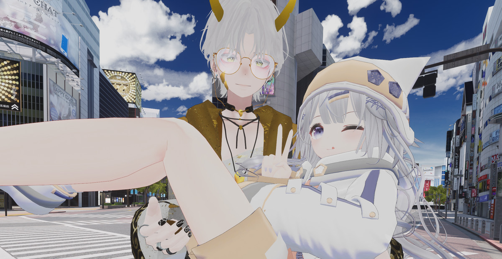
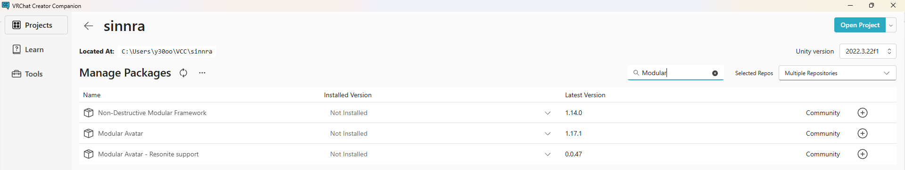
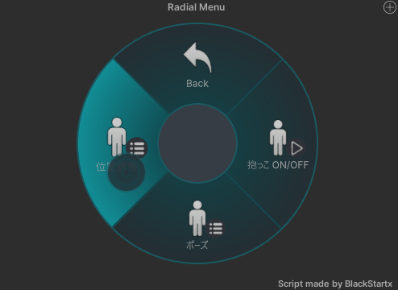

# VRC Princess Carry System v2.0 — User Manual



**VRC Princess Carry System** is a two-person avatar gimmick for VRChat Avatars 3.0.

The carrier can hold another player, the princess, in a princess-carry pose.  
Version 2.0 ships **two install options — Modular Avatar and VRCFury** — so setup is non-destructive and only requires placing one prefab under your avatar.

This system works in both **VR** and **Desktop** mode.

---

## 1. Requirements

| Item | Recommended |
| --- | --- |
| VRChat Creator Companion (VCC) | Latest version |
| Unity | 2022.3.22f1 |
| VRChat Avatars SDK | 3.7 or newer, tested with 3.10 |
| **Modular Avatar 1.10+** *or* **VRCFury** | one of the two (both free) |

This package includes a **Modular Avatar** prefab and a **VRCFury** prefab. You only need one of the two installers — pick whichever you already use.

If Modular Avatar is not installed:

1. Open your avatar project in VCC.
2. Click `Manage Project`.
3. Add Modular Avatar with the `+` button.

Repository URL:

```text
https://vpm.nadena.dev/vpm.json
```



---

## 2. Installation

### Step 1 — Import the unitypackage

Import the package into your avatar project:

```text
PrincessCarrySystem_v2.0_EN.unitypackage
```

After import, the main package files will be added under:

```text
Assets/meteo/PrincessCarry_EN/
```

Note: Some animation assets are included under:

```text
Assets/meteo/お姫様抱っこ/Anim/
```

Japanese folder names are kept for asset compatibility.

### Step 2 — Add the prefab to your avatar

This package ships **two install options**. Pick **one** (do not use both at once):

**[A] Modular Avatar (recommended)** — requires Modular Avatar 1.10+
```text
Assets/meteo/PrincessCarry_EN/PrincessCarry.prefab
```

**[B] VRCFury** — requires VRCFury (https://vrcfury.com/)
```text
Assets/meteo/PrincessCarry_EN/PrincessCarry_Fury.prefab
```

Drag the prefab of your choice directly under the top-level avatar object (the one with the `VRC Avatar Descriptor`). Both prefabs produce the exact same in-game result — use whichever installer you already have.

Modular Avatar / VRCFury will automatically merge the menu, parameters, and animator setup at build time.

### Step 3 — Upload

Upload your avatar as usual with the VRChat SDK `Build & Publish` button.

No manual animator layer merging, expression menu assignment, expression parameter setup, or constraint source setup is required.

---

## 3. Action Menu

After uploading, a new menu will appear in your Action Menu:

```text
Princess Carry
```



### Menu Items

- `Carry ON/OFF`  
  Turns the princess carry system on or off.  
  When enabled, the seat position for the princess becomes active.

- `Pose`  
  Changes the carrier’s pose.

  Available poses:

  - `Release`
  - `Standing`
  - `Air chair`
  - `Floor sit`

- `Position`  
  Adjusts the princess carry position in-game.

  Available controls:

  - `Forward/Back`
  - `Up/Down`
  - `Left/Right`

---

## 4. How to Use

### Carrier Side

1. Open the Action Menu.
2. Go to `Princess Carry`.
3. Turn on `Carry ON/OFF`.
4. Choose a carrier pose from `Pose`.

### Princess Side

1. The carrier turns `Carry ON/OFF` on.
2. The princess moves close to the carry position.
3. The princess uses `Use / Interact` to sit in the carry position.
4. To get off, the princess uses the normal stand-up action, such as jump.

> Warning: The princess may experience VR motion sickness if the carrier moves quickly or turns suddenly. Please use gently, especially with VR users.

---

## 5. Adjusting the Carry Position

The carry seat automatically follows the carrier’s hips using Bone Proxy (Modular Avatar, or the equivalent setup already built into the VRCFury prefab). Because it is hip-anchored — the same as ver1 — turning your head or chest with 3-point tracking will barely move the princess.

There are two ways to adjust the position.

### A. Base Position in Unity

For broad adjustment, edit the Transform position of the `Rig` object inside the prefab.

Recommended starting point:

```text
Y = 0
Z = 0.27
```

This places the princess at hip height, in front of the carrier’s hips (identical to ver1).

The position you set here becomes the base position.

### B. Fine Adjustment In-Game

Use the Action Menu:

```text
Princess Carry > Position
```

Available radial controls:

- `Forward/Back`  
  Moves the carry position forward or backward by up to approximately ±0.2 m.

- `Up/Down`  
  Moves the carry position up or down by up to approximately ±0.2 m.

- `Left/Right`  
  Moves the carry position left or right by up to approximately ±0.2 m.

These menu adjustments are relative offsets added on top of the Unity base position.

The settings are saved and will remain after changing worlds or reloading the avatar.  
A radial value of `0.5` means no offset from the base position.

---

## 6. Avatar Scale Support

Version 2.0 uses Bone Proxy with **Match Scale** enabled (Modular Avatar, or the equivalent already set up in the VRCFury prefab).

This means the carry seat follows changes to the carrier avatar’s scale.  
If you change your avatar height in VRChat, the princess carry position should stay much closer to the intended location.

Some manual adjustment may still be needed depending on avatar proportions, arm length, and body shape.

---

## 7. VRCEmote Is Not Used

Older versions used the standard `VRCEmote` parameter for pose switching, which could conflict with normal avatar emotes.

Version 2.0 uses its own dedicated parameter:

```text
Meteo_Pose
```

Your regular avatar emotes can remain available.

---

## 8. Parameters

This system uses the following parameters:

| Parameter | Usage |
| --- | --- |
| `Dakko` | 1 bit |
| `Meteo_Pose` | 8 bit |
| `Meteo_OffZ` | 8 bit |
| `Meteo_OffY` | 8 bit |
| `Meteo_OffX` | 8 bit |

Total parameter cost:

```text
33 bit
```

If you do not need in-game position adjustment, you can remove `Meteo_OffZ`, `Meteo_OffY` and `Meteo_OffX` from the parameter setup (in Modular Avatar, or on the VRCFury prefab) to reduce the cost to:

```text
9 bit
```

Make sure your avatar stays within VRChat’s 256-bit expression parameter limit.

---

## 9. FAQ / Troubleshooting

### Q. The `Princess Carry` menu does not appear.

Check the following:

- The prefab is placed directly under the avatar root.
- Modular Avatar (or VRCFury) is installed in the project.
- The avatar was uploaded after adding the prefab.
- Modular Avatar (or VRCFury) processing appears in the build log.

### Q. The princess position is too far from the body.

Adjust the `Rig` object position inside the prefab.  
See section 5, “Adjusting the Carry Position.”

After that, use the in-game `Position` menu for fine adjustment.

### Q. The princess cannot sit.

Check the following:

- `Carry ON/OFF` is turned on.
- The princess is close enough to the carry position.
- The princess is using `Use / Interact`.
- The carrier avatar is visible to the princess.
- Avatar interaction or safety settings are not blocking the station.

### Q. VRChat says my avatar uses too many parameters.

This system uses 33 bits by default:

```text
Dakko       1 bit
Meteo_Pose  8 bit
Meteo_OffZ  8 bit
Meteo_OffY  8 bit
Meteo_OffX  8 bit
```

If your avatar is near the 256-bit limit, remove the position adjustment parameters `Meteo_OffZ`, `Meteo_OffY` and `Meteo_OffX` from the parameter setup (in Modular Avatar, or on the VRCFury prefab).  
This reduces the system to 9 bits, but disables in-game position adjustment.

### Q. Does this work on Quest / Android?

The initial English release is **PC-only**.

Quest / Android support is currently under testing.  
Because this system uses avatar stations, Android behavior needs to be verified carefully before Quest support is advertised.

---

## 10. Known Limitations

- The initial English release is PC-only.
- The princess may experience motion sickness if the carrier moves too quickly.
- If the princess is using full-body tracking, their viewpoint may jump upward due to VRChat station behavior.
- For full-body tracking users, it is recommended that the princess manually pose themselves when possible.
- The carry position may need adjustment depending on avatar scale and proportions.
- Other users must be able to see and interact with the carrier avatar.
- Avatar safety settings, hidden avatars, or blocked interactions may prevent the system from working as intended.
- This package does not include an avatar model.

---

## 11. Update History

### v2.0 EN

- English package release.
- Added Modular Avatar support.
- Added drag-and-drop non-destructive setup.
- Removed dependency on `VRCEmote`.
- Added dedicated `Meteo_Pose` parameter.
- Added avatar scale support with Bone Proxy Match Scale.
- Added in-game position adjustment.
- Updated for Unity 2022 and current VRChat Avatars SDK versions.
- Rewritten English manual.

### v1.02

- Fixed collider-related issue.

### v1.01

- Bug fixes.
- Animation updates.

### v1.00

- Initial release.

---

## 12. License / Terms

See [TERMS.md](TERMS.md) (the same terms are included in the package as `LICENSE_EN.txt`).

---

Creator: **meteo** / Supervision: **RYU_2**  
Support: **X @meteo_vr**

Wishing you a smooth upload and a comfortable carry.